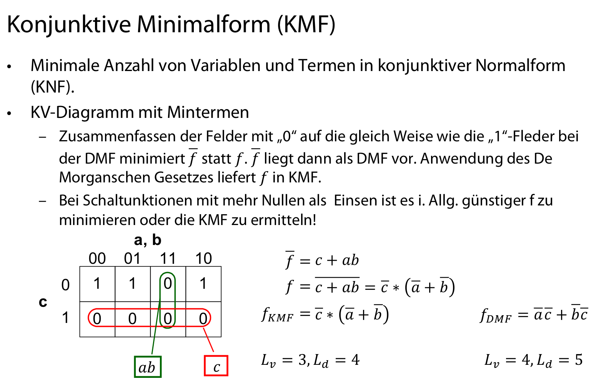
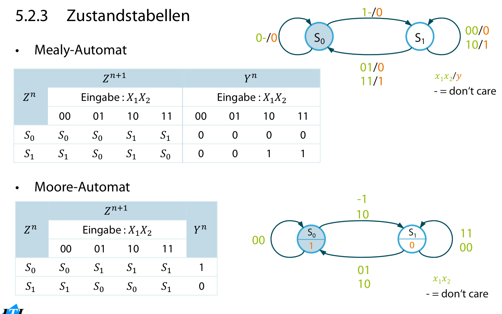
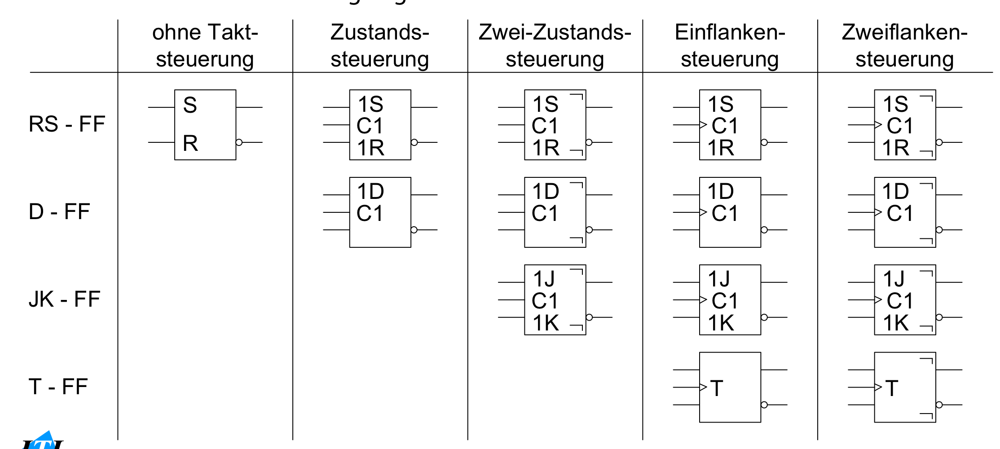
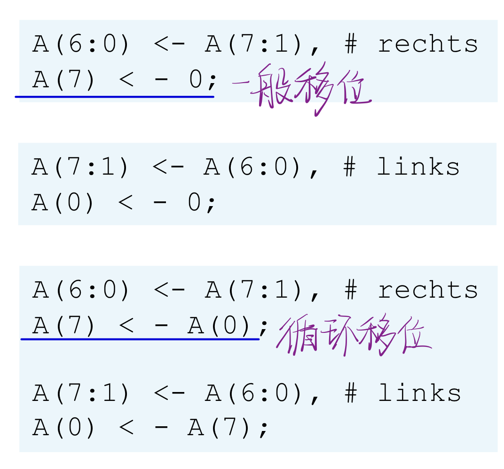
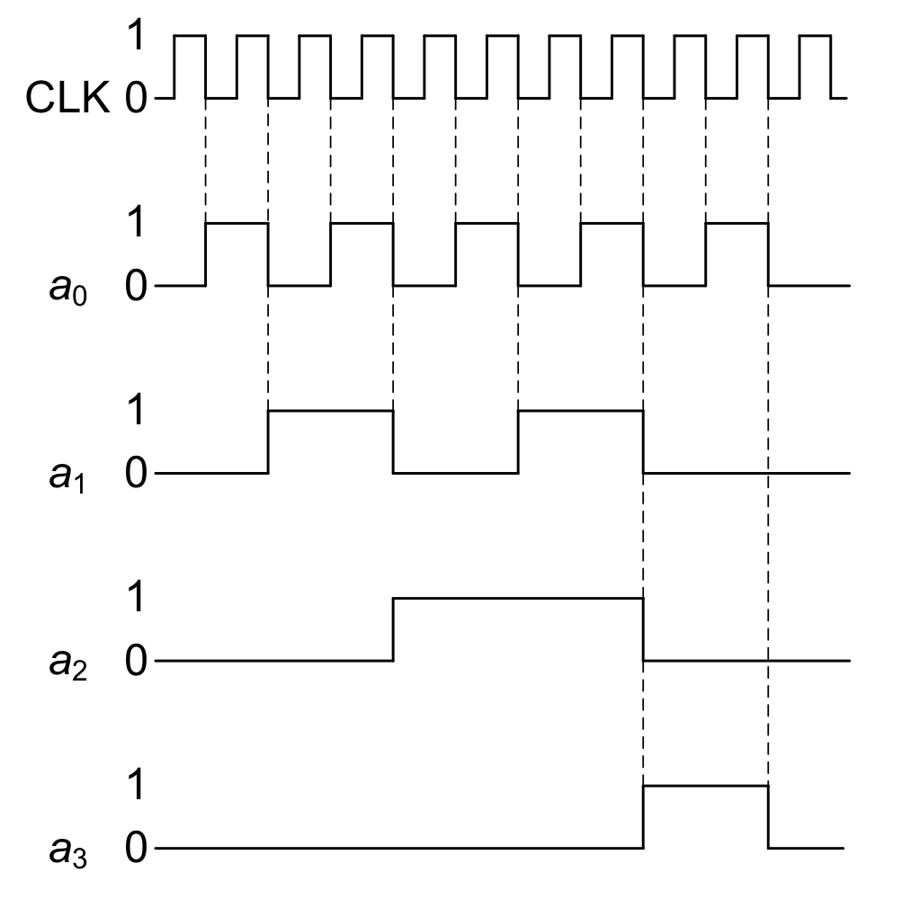
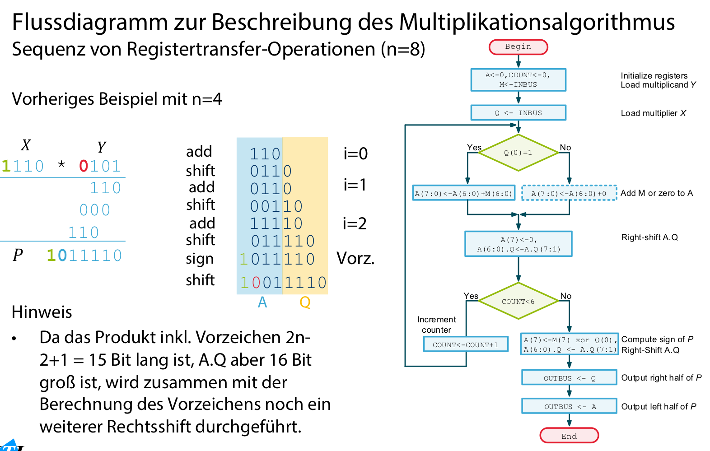
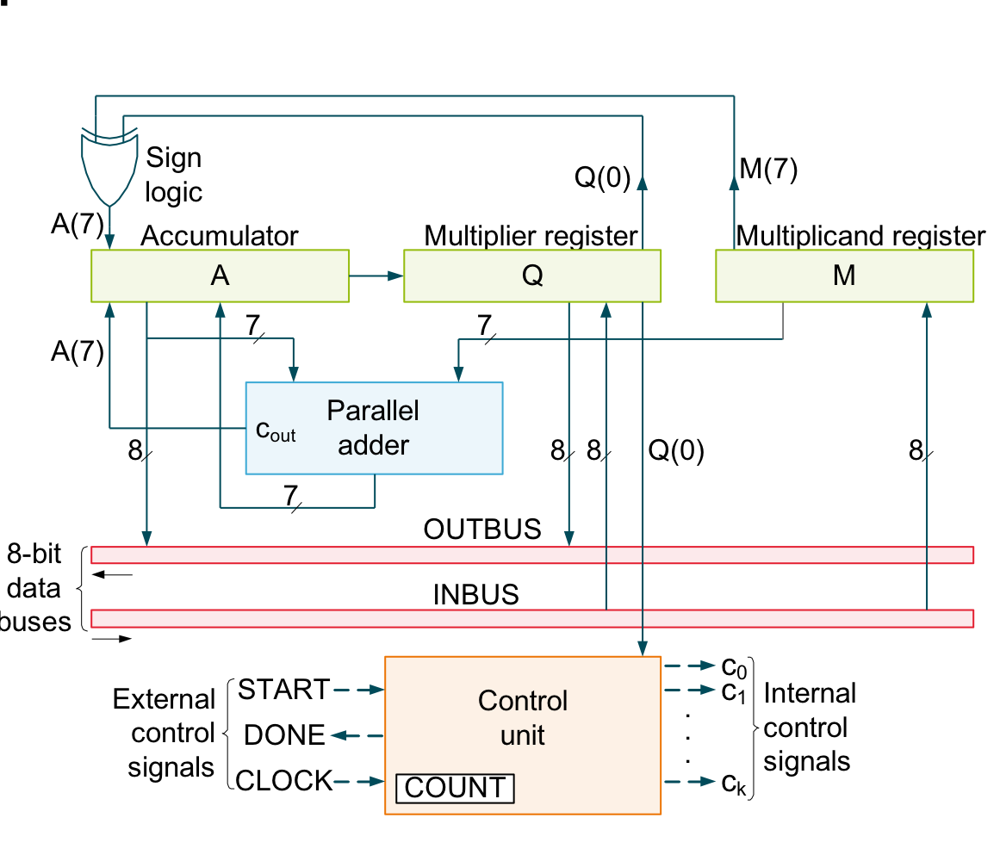
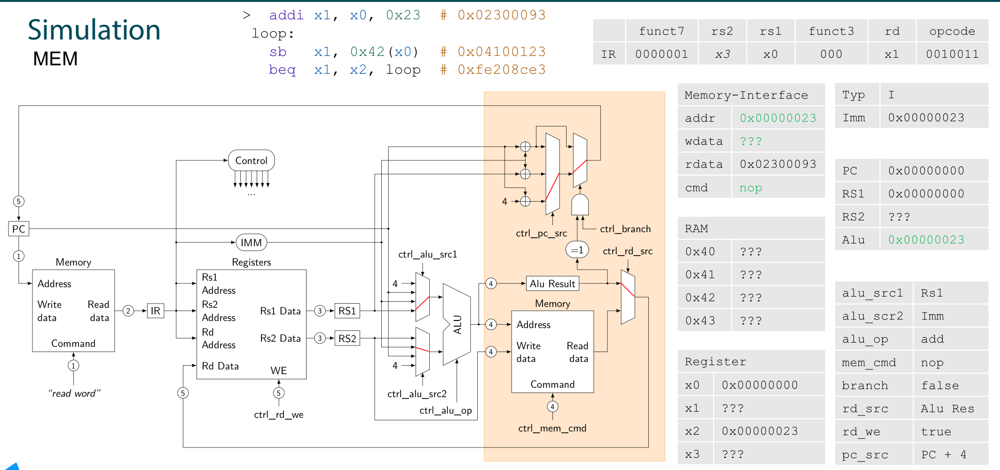

# TGI [\>\>](marginnote3app://note/3D58CD9C-A830-4DFE-ACC4-A4E5B9ACCDA8)

## 开关函数 Schaltalgebra und Schaltfunktionen \>\>

### 运算定律及运算性质 \>\>

  
  

### 真值表 \>\>

### 开关函数 \>\>

  
  
  
  

### 布尔范式 Boolesche Normalformen \>\>

• Es gibt mehr Boolesche Ausdrücke als Funktionen. Unter anderem zu Vergleichszwecken drängt sich deshalb eine Normalform auf. • Jeder Zeile der Wahrheitstafel kann ein Minterm zugeordnet werden. Dieser entsteht durch UND-Verknüpfung der zugehörigen Schaltvariablen, die im Falle einer 0 negiert und für eine 1 nichtnegiert übernommen werden 真值表的每个行都是一个Minterm • Jeder Minterm erzwingt für ‚seine‘ Zeile eine 1, für alle anderen Zeilen ist er 0 每个Minterm的结果不是1就是0 • Die ODER-Verknüpfung (Disjunktion) der Minterme für den Funktionswert 1 liefert dann eine eindeutige Darstellung der Schaltfunktion, die disjunktive kanonische Normalform (DKN)

#### DNF 析取范式 \>\>

DKN 标准析取范式 Disjunktive kanonische Normalform (DKN) – Disjunktion von Mintermen ⇒ Ein Term kann ganze Funktion auf „1“ setzen 把Minterm中所有取1的拿出用且的关系连接 – Minterme sind daran erkennbar, dass sie alle Schaltvariablen der Schaltfunktion entweder negiert oder nichtnegiert enthalten. – Jede beliebige Schaltfunktion ist somit als DKN und damit mittels Schaltalgebra unter Verwendung der Operatoren UND, ODER, NICHT darstellbar. Diese Operatoren sind damit eine vollständige Verknüpfungsbasis (Junktorensystem) 并通过将所有的Minterm用和的关系连接  
• Disjunktive Normalform (DNF) – Ist nicht kanonisch, da sie nicht nur aus Mintermen besteht (nicht jeder Teilterm enthält jedes Literal)! – Es gibt keine eindeutige Normierung mehr 将DKN化简  
  

##### Minimierung \>\>

Minimierungsverfahren • Angelpunkt zur Reduktion komplexer Funktionen in DNF ist folgende Beziehung 𝑝∗𝑥+𝑝∗𝑥=𝑝∗ 𝑥+𝑥 =𝑝∗1=𝑝 𝑝:beliebigerkonjunktiverTeilterm • Unterscheiden sich zwei Terme nur dadurch, dass eine Variable in dem einen Term nicht negiert und dem anderen Term negiert vorkommt, können beide zu einem Term verschmolzen werden, der nur die identischen Variablen enthält (Verschmelzungsgesetz).

##### DMF 析取最小范式 \>\>

• Definition – Ein Term 𝑇 = x1\*x2\*x3\*x4….. mit 𝑑K ∈ {0,1,2} einer Funktion in disjunktiver Normalform (DNF) heißt Primimplikant, wenn in der DNF kein Term 𝑇’ existiert, der sich gemäß 蕴含项 𝑝∗𝑥+𝑝∗𝑥=𝑝∗ 𝑥+𝑥 =𝑝∗1=𝑝 aus 𝑇 zu einem einfacheren Term zusammenfassen lässt. – Eine DNF 𝐴 heißt disjunktive Minimalform (DMF) bzgl. einer Längendefinition 𝐿, wenn es für die durch 𝐴 dargestellteFunktionkeineDNF𝐴’gibt,diebzgl.𝐿kürzerist,d.h.wennkeinA’existiertmit𝐿𝐴’ \<𝐿(𝐴). • Satz – Gegeben sei eine Längendefinition, bei der die Länge eines Ausdrucks nicht steigt, wenn eine Variable gestrichen wird. Dann existiert zu jeder Schaltfunktion wenigstens eine DMF, die eine Disjunktion von Primimplikanten ist. – Bemerkung: Für 𝐿H und 𝐿I erfüllt

#### KNF 合取范式 \>\>

Maxterme entstehen (analog zu Mintermen) durch ODER-Verknüpfung der zugehörigen Schaltvariablen (nicht negiert für 0, negiert für 1). 将每个行为0的拿出用合连接 Jeder Maxterm kann für genau eine Zeile eine Null erzwingen Für alle anderen Zeilen außer seiner eigenen ist er Eins Die UND-Verknüpfung (Konjunktion) der Maxterme für den Funktionswert 0 liefert dann eine eindeutige Darstellung der Schaltfunktion, die konjunktive kanonische Normalform (KKN). 将各个Maxterm用且连接  
  

##### Minimierung \>\>

• Nach dem Dualitätsprinzip können ganz entsprechend wie für die DNF auch Funktionen in KNF minimiert werden. Das Verschmelzungsgesetz lautet dann (𝑝+𝑥) ∗ (𝑝+𝑥) =𝑝+ (𝑥∗𝑥) =𝑝+0=𝑝 𝑝:beliebigerdisjunktiverTeilterm • Systematische Minimierungsverfahren – Minimierung durch Umformung per Hand sehr aufwendig und mühsam! – Daher sind systematische Minimierungsverfahren entwickelt worden (z. B. KV-Diagramme, Quine- McCluskey), die garantiert eine Minimalform finden. – Heute in der Regel in Tools zum Schaltungsentwurf integriert. – Hier nur Minimierung von DKN mit bis zu bis vier Variablen mit Hilfe von KV-Diagrammen Vertiefung und Erweiterung =\> siehe TGI 2

#### Minimierung \>\>

Optimierungskriterien – Minimale Anzahl von Variablen 𝐿H(𝐴) in einem Ausdruck 𝐴 (entspricht der Anzahl der Eingänge der UND- Gatter der ersten Stufe bzw. einzelner Eingänge des ODER-Gatters). 𝐿H(𝐴)是接口数 – 𝐿I 𝐴 = 𝐿H 𝐴 + Zahl disjunktiv verknüpfter Terme mit mehr als einer Variablen (entspricht der Gesamtzahl der Gattereingänge).

##### KV图化简 \>\>

I. 生成KV图 Darstellung einer Schaltfunktion als KV- Diagramm – Einteilung eines Rechtecks in 2N Felder, die den Mintermen der Schaltfunktion entsprechen. – Benachbarte Felder unterscheiden sich genau um eine Variable (möglich bis zu 6 Variablen, ab 5 aber bereits recht unübersichtlich.   
  
  
II. 找到Minterm Eintragung der zur DKN gehörigen Minterme  
  
  
III.运用结合律化简 Verschmelzung benachbarter Minterme 1. Die Variable, um die sich die Felder unterscheiden, fällt weg. 2. Die benachbarten Minterme reduzieren sich auf einen Term mit den verbleibenden gemeinsamen Variablen. 3. Verallgemeinerung auf 2\^k benachbarte „1“ Felder mit 𝑖 = 1, 2, 3, ... Es fallen dann jeweils 𝑖 Variablen weg.  
IV.KV图化简 Minimierung mit KV-Diagrammen – Primimplikanten Durch Zusammenfassen von Mintermen zu möglichst großen Feldern der Größe 2K erhält man die Primimplikanten der Funktion. 素蕴涵项:这些项有重叠，去掉其中一个仍然成立，表示的是不同的形式或是不同的可能 – Wesentliche (Kern-) Primimplikanten Diejenigen Felder, die als einzige einen Minterm überdecken, entsprechen den wesentlichen oder Kern-Primimplikanten und müssen in die DMF aufgenommen werden. 质蕴涵项:这些项是唯一的，去掉其中的会使式子不完备 – Minimale Restüberdeckung Die noch nicht abgedeckten Minterme müssen mit einer minimalen Anzahl der verbleibenden (nicht wesentlichen) Primimplikanten überdeckt werden (i. Allg. nicht eindeutig!).   
  

###### 更多的变量 \>\>

###### KMF的化简 \>\>

  
  

###### 不完全定义的函数 \>\>

Partiell definierte Schaltfunktionen – Für einige Variablenbelegungen ist der Funktionswert nicht definiert (bzw. beliebig 0 oder 1, “don’t care“)   
  
  
 – Im Falle der DMF werden sie so mit dem Wert „1“ belegt, dass möglichst große „1“-Felder entstehen

###### 卡诺图 \>\>

  
  
  
  

##### MC奎因化简 \>\>

Schritt 1: Bilden der DKN 生成DKN  
  
  
Schritt II: Ermitteln der Primimplikanten 得到素蕴涵项 • Einteilen der Minterme in Klassen 𝐾' mit 𝑖 nichtnegierten Variablen – Binärdarstellung, 1 entspricht 𝑥, 0 entspricht 𝑥, „-“ steht für herausgefallene Variable – Beispiele: 1101 entspricht 𝑎𝑏𝑐𝑑, 0-01 entspricht 𝑎 𝑐𝑑   
  
  
Schritt III: Wesentliche Primimplikanten 得到质蕴涵项 • Aufstellen der Primimplikantentafel – Listet die Minterme (Nummern in den Spalten) auf, die der jeweilige Primimplikant 𝑃! abdeckt; diejenigen Minterme, aus denen 𝑃! durch Verschmelzung entstanden ist.  
  
  
Schritt IV: Minimale Restüberdeckung 剩余部分最小化 • Wesentliche Primimplikanten (hier P1, P4) decken i. A. nur einen Teilbereich ab (farbig markiert). • Rest wird durch minimale Anzahl unwesentlicher Primimplikanten abgedeckt – i. A. nicht eindeutig! – Hier vier Möglichkeiten für gleichwertige Lösungen: (P2 oder P3) und (P5 oder P6) • Minimierte Schaltfunktion (DMF) – Disjunktion aus wesentlichen Primimplikanten und den unwesentlichen Primimplikanten aus einer minimalen Restüberdeckung  
  

###### 奎因麦克拉斯算法 \>\>

  
  
  
  

## 组合逻辑电路 Schaltnetz \>\>

Realisierung z. B. mittels Gattern (z. B. UND, ODER, NEGATION) oder PLDs. 由与，或，非等逻辑门电路组成  
 Combinational logic, kein Gedächtnis. Die Ausgangsgrößen hängen nur von den Eingangsvariablen ab. 组合逻辑是无记忆数字逻辑电路，其任何时刻的输出仅取决于其输入的组合。  
  

## CPU [\>\>](marginnote3app://note/1A48D1F0-FEB5-4EF4-ACAC-0EC2B0FA4AC2)

  
  
  
  
  
  
  
ABlauf der Maschinenbefehle  
  
  
  
  
  
  
  

### Moore-Timing [\>\>](marginnote3app://note/FD08E065-B62D-4762-8AD9-BB467899352D)

  
  
  
  

### Mealy-Timing [\>\>](marginnote3app://note/341CA00C-BAD2-44BF-BAF4-29E230ED5614)

  
  
  
  

## 时序逻辑电路 Schaltwerk \>\>

Schaltungen mit inneren Zuständen, die ebenfalls die Ausgangsfunktionen beeinflussen. 由储存电路和组合逻辑电路组成。其在任何一个时刻的输出状态由当时的输入信号和电路原来的状态共同决定，而他的状态主要由储存电路来记忆和表示的。  
  
  
  

### 同步与异步时序电路 \>\>

Synchrone Schaltwerke Takt sorgt für sequentielle Arbeitsweise (neuen Zustand übernehmen und für die nächste Taktperiode speichern). 同步时序电路中所有存储器件都在时钟脉冲CP的统一控制下，用触发器作为存储器件。几乎现在所有的时序逻辑都是“同步逻辑”：有一个“时钟”信号，所有的内部内存（'内部状态'）只会在时钟的边沿时候改变。在时序逻辑中最基本的储存器件是触发器。 同步逻辑最主要的优点是它很简单。每一个电路里的运算必须要在时钟的两个脉冲之间固定的间隔内完成，称为一个 '时钟周期'。只有在这个条件满足下（不考虑其他的某些细节），电路才能保证是可靠的。 Asynchrone Schaltwerke Zustandsänderung bei Änderung der Eingangsbelegung (abhängig von Laufzeiten) 异步时序逻辑是循序逻辑的普遍本质，但是由于它的弹性关系，他也是设计上困难度最高的。最基本的储存器件是锁存器。锁存器可以在任何时间改变它的状态，依照其他的锁存器信号的变动，他们新的状态就会被产生出来。异步电路的复杂度随着逻辑门的增加，而复杂性也快速的增加，因此他们大部分仅仅使用在小的应用。然而，电脑辅助设计工具渐渐的可以简化这些工作，允许更复杂的设计。

### 状态机 \>\>

状态图  
  
  
状态表  
  
  
VHDL模拟图  
  

#### 摩尔型状态机 \>\>

输出只跟内部的状态有关。（因为内部的状态只会在时脉触发边缘的时候改变，输出的值只会在时脉边缘有改变） 摩尔型有限状态机的输出只与有限状态自动机的当前状态有关，与输入信号的当前值无关。摩尔型有限状态机在时钟脉冲的有效边沿后的有限个门延后，输出达到稳定值。即使在一个时钟周期内输入信号发生变化，输出也会在一个完整的时钟周期内保持稳定值而不变。输入对输出的影响要到下一个时钟周期才能反映出来。摩尔型有限状态机最重要的特点就是将输入与输出信号隔离开来。  
  
  
代码  
状态图例  
  
  
实体  
  
  
提纲部分  
  
  
状态储存器和输出逻辑部分  
  
  
状态逻辑部分  
  
  
  

#### 米利型状态机 \>\>

输出不只跟目前内部状态有关，也跟现在的输入有关系。 Mealy有限状态机的输出不单与当前状态有关，而且与输入信号的当前值有关。Mealy有限状态机的输出直接受输入信号的当前值影响，而输入信号可能在一个时钟周期内任意时刻变化，这使得Mealy有限状态机对输入的响应发生在当前时钟周期  
  
  
  
  
代码  
状态图例  
  
  
实体部分  
  
  
提纲部分  
  
  
状态储存器  
  
  
状态逻辑部分  
  
  
输出逻辑部分  
  
  
  

### 触发器 \>\>

触发器是一种具有记忆能力、构成时序逻辑的基本单元电路。一个触发器能“存储”一位二进制数字信息：“0”或“1”。该电路可以通过一个或多个施加在控制输入端的信号来改变自身的状态，并会有1个或2个输出。  
一个触发器有两个稳定状态： 1 “0”状态：Q＝0，＝1； 2 “1”状态：Q＝1，＝0。  
触发器（FF）应具有以下功能： 1 在新数据输入之前（无触发信号）时，触发器一直保持原来的状态（原数据）不变。 2 输入信号触发下，它能从一种状态转换为另一种状态。即：FF能够“接收”“保持”并“输出”数字信息。  
触发器（FF）的分类： 1 从功能分： 1 RS触发器（置0、置1触发器） 2 JK触发器（多功能触发器） 3 D触发器（延迟触发器） 4 T触发器（翻转触发器） 2 从结构分： 1 基本RS触发器 2 同步触发器（时钟CP-FF） 3 主从触发器 4 维持-阻塞触发器（WZ-FF） 5 CMOS边沿触发器 3 从触发方式分： 1 电位触发： 1 高电位触发 2 低电位触发 2 边沿触发： 1 上升沿触发 2 下降沿触发  
  

#### RS-触发器 \>\>

  
  
  
  
  
  
  
当R与S皆为低电位，回授会让Q与Q（Q的反相）保持于一个固定的状态。 当S（Set）为高电位，R（Reset）为低电位时，输出Q会被强制设置为高电位；相反的，当S为低电位，R为高电位时，输出Q会被强制设置为低电位。  
RS-触发器的时钟控制 Eingangsbeschaltung des asynchronen RS-Flipflops mit zwei UND-Gattern. Nur bei Takt C = 1 kann das Flipflop Eingangsinformation übernehmen, bei C = 0 wird der aktuelle Wert gehalten. Wird im Englischen auch als ‚Latch‘ (‚Klinke‘) bezeichnet.  
  
  
  
  
Serielle Schaltung aus zwei RS-Flipflops (Zweizustandssteuerung) – C = 1: Master wird gesetzt, Slave hält alten Wert – C = 0: Slave übernimmt neuen Wert, Master ist deaktiviert. Die RS-Signale sollten sich nur während der Halbperiode C = 0 ändern und während C = 1 stabil bleiben, da sonst falsche Werte übernommen werden können!

#### D-触发器 \>\>

• Nur ein Dateneingang D und ein Takteingang C • Werte am Eingang D zum Zeitpunkt n werden zum Zeitpunkt n+1 am Ausgang Q sichtbar, d. h. mit einer Verzögerung (Delay) von einem Takt  
触发器 在clk正跳沿前接收输入信号 在clk正跳沿是触发翻转 在clk正跳沿后输入被封锁  
  
  
  
  
  
  
D-触发器的时钟控制  
  

#### JK-触发器 \>\>

JK触发器和触发器中最基本的RS触发器结构相似，其区别在于，RS触发器不允许R与S同时为1，而JK触发器允许J与K同时为1。当J与K同时变为1的同时，输出的值状态会反转。也就是说，原来是0的话，变成1；原来是1的话，变成0。  
  
  
Vermeidet gleichzeitiges R = 1, S = 1 durch vorgeschaltete UND-Gatter. Achtung: Master kann während der Halbperiode C = 1 seinen Zustand aufgrund der Verriegelung nur einmal ändern Regel: Die JK-Signale sollten sich nur während der Halbperiode C = 0 ändern und während C = 1 stabil bleiben! Zweizustandssteuerung – C = 1: Immer nur ein Eingang ist wirksam, der andere gesperrt: FürQ=0istJoffenundKgesperrt. FürQ=1istKoffenundJgesperrt. – C = 0: Beide Eingänge gesperrt, Zustand wird vom Master in Slave übernommen.  
  

#### T-触发器 \>\>

T触发器（Toggle Flip-Flop，or Trigger Flip-Flop）设有一个输入和输出，当时脉由0转为1时，如果T和Q不相同时，其输出值会是1。输入端T为1的时候，输出端的状态Q发生反转；输入端T为0的时候，输出端的状态Q保持不变。把JK触发器的J和K输入点连接在一起，即构成一个T触发器。  
  
  
• Falls beim JK-(MS)-Flipflop E = J = K = 1 und ein zusätzlicher Takt angelegt wird, ergibt sich ein Wechselflipflop. • Varianten mit Zweiflankensteuerung ebenfalls gebräuchlich.  
  

### 时间脉冲控制 Taktsteuerung \>\>

• Zusätzlicher Takteingang C (Clock), der den Zeitpunkt des Umschaltens des Flipflops bestimmt (synchrone Arbeitsweise) 在同步电路中，Takt扮演计时器的角色，只有同步信号到达的时候，子昂管的触发器才会按输入信号改变状态  
• Zustandssteuerung – Am Eingang anliegende Information wird während der gesamten Dauer des Taktimpulses C übernommen (und wirkt am Ausgang) 状态控制   
  
  
• Einflankensteuerung – Eingangsinformation wird mit aktiver (positiver oder negativer) Taktflanke von C übernommen. Anschließende Änderungen während der Impulsdauer des Taktes wirken sich nicht mehr am Ausgang aus 边缘控制  
  
  
 • 创建时间（setup time）是指数据在被采样时钟边沿采样到之前，需保持稳定的最小时间。 也就是时钟信号边沿到来前，数据稳定不变的时间，时间不够，数据不能被稳定打入触发器 • 维持时间（hold time）是指数据在被采样时钟边沿采样到之后，需保持稳定的最小时间。 也就是时钟信号边沿到来之后，数据保持不变的时间，时间不够，数据不能稳定打入触发器  
没有时钟脉冲时，输入信号有一个传播时延(propagation dalay) 时延的差别导致会有短暂的不希望出现的信号，也就是空翻现象(race condition)  
  

### 执行单元 \>\>

#### ALU [\>\>](marginnote3app://note/B8164E17-E1C7-4BA8-8B0A-1368D8982288)

  
  
  
  
  
简单运算 大部分ALU都可以完成以下运算∶ 整数算术运算 位逻辑运算（与、或、非、异或） 移位运算（将一个字向左或向右移位或浮动特定位，而无符号延伸），移位可被认为是乘以2或除以2。 复杂运算 工程师可设计能完成任何运算的ALU，不论运算有多复杂；问题在于运算越复杂，ALU成本越高，在处理器中占用的空间越大，消耗的电能越多。

#### 寄存器 [\>\>](marginnote3app://note/F064A782-E948-402E-816F-AC51D61D2E10)

• Operanden stehen in Registern A und B, Ergebnis in Register D. 运算子在寄存器中A,B中保存，结果在D中保存  
  
  
  
  
  

#### 标志 Flags [\>\>](marginnote3app://note/A57CE71B-B8B0-489C-A99B-E35A0C6956B9)

• Flags (z. B. Carry, Overflow, Zero, Negative) werden als sog. Kriterien ausgegeben. 标志（Flag）用于反映指令执行结果或控制指令执行形式。 许多指令执行之后将影响有关的状态标志位；不少指令的执行要利用某些标志；当然，也有很多指令与标志无关。 状态标志有6个，处理器主要使用其中5个构成各种条件，分支指令判断这些条件实现程序分支。 它们从低位到高位是： 进位标志CF（Carry Flag） 奇偶标志PF（Parity Flag） 调整标志AF（Adjust Flag） 零标志ZF（Zero Flag） 符号标志SF（Sign Flag） 溢出标志OF（Overflow Flag） 控制标志 控制标志用于控制处理器执行指令的方式，可由程序根据需要用相关指令设置。 8086的控制标志有3个： 方向标志DF（Direction Flag），仅用于串操作指令中，控制地址的变化方向； 中断允许标志IF（Interrupt-enable Flag）或简称中断标志，用于控制外部可屏蔽中断是否可以被处理器响应； 陷阱标志TF（Trap Flag），也常称为单步标志，用于控制处理器是否进入单步操作方式。  
  

#### 控制信号 OP [\>\>](marginnote3app://note/BB6D1AE6-10C5-42F5-BED3-59E17619DE33)

• Operation op wird über Kontrollsignale OP ausgewählt. 运算方式通过控制信号OP选择执行什么操作

## 寄存器 Registertransfer \>\>

Geordnete Menge von Speicherelementen (oft 8, 16, 32 oder 64 Bit) 寄存器的功能是存储二进制代码，是由具有储存功能的触发器组成，一个触发器可以储存一位二进制代码，存放n位二进制代码，需n个触发器 Register dienen in der Regel der (schnellen) Zwischenspeicherung von Daten, nicht deren längerfristigen Aufbewahrung wie Speicherwerke • Registertransfer-Ebene ist beim Rechnerentwurf wichtige Betrachtungsebene oberhalb der Gatterebene 寄存器传输表示法 Register dienen in der Regel der (schnellen) Zwischenspeicherung von Daten, nicht deren längerfristigen Aufbewahrung wie Speicherwerke 用于数据的中间储存，不能用于长时间储存  
  
  
• Wert rechts wird im nächsten Takt in das Register links vom Pfeil transferiert. • Die Werte rechts bleiben dabei erhalten, das Register links wird überschrieben. • Vergleich – Wertzuweisung in höheren Programmiersprachen! • Abstrahiert von der konkreten Implementierung der Register.

### 寄存器的运算 Operationen \>\>

### 移位寄存器 Schieberegister \>\>

  
  
  
Bei jedem Takt wird der Registerinhalt um eine Position nach rechts bzw. nach links weitergeschoben. 每个时钟将寄存器的内容向左或右依次移动一个位置 Beim normalen Shift wird eine 0 von links bzw. rechts nachgezogen, beim Ringshift das am weitesten rechts bzw. links liegende Bit 一般移位，会在最左边或最右边补0, 循环移位，会将移出寄存器的再移到另一边  
  
  
平行输入输出  
  

### 计数寄存器 Zähler \>\>

Registertransfer: A =A + 1   
  
  
  
  
四位触发器可以保存16个数 八位寄存器可以保存256个数 十六位寄存器可以保存65535个数  
异步计数器  
  
  
• Kein gemeinsamer Takt, sondern Takteingang jeweils mit Q-Ausgang der vorangehenden Stufe verbunden (daher ‚asynchron‘). • Kaskadierung für größere n über RCO-Ausgang möglich. • Viele weitere Varianten von Zählern, z.B. mit Reset- und Preset-Eingängen, BCD (Binary Coded Decimals)-Zähler (mod 10), verschiedene Codes etc.  
同步二进制浮点计数器 Synchroner BCD-Zähler • Zählt im BCD (Binary Coded Decimal)-Code, d. h. wie Dualzähler, aber mod. 10 最大到10, 因此可以计十进制的数  
  
  
  
  
  

### 多个寄存器的运算 Operationen mit zwei oder mehr Registern \>\>

  
  
  
  
  
平行加法器  
  
  
• Inhalt von Register A wird durch die Summe der Inhalte von Register A und B ersetzt, der von Register B bleibt erhalten. 寄存器A中的数和寄存器B中的数 • Addition findet in einem Takt statt. 在一个时钟内完成加法部分 • Realisierung z. B. als Addierer mit durchlaufendem Übertrag (Ripple-Carry) oder anderes Addierer-Schaltnetz. • 2 Register Variante Summe wird in Register A abgelegt, B bleibt erhalten 结果还会保存在寄存器A中 • 3 Register Variante Summe wird in Register D abgelegt, A und B bleiben erhalten.结果保存在新的寄存器D中

### 寄存器传输层 [\>\>](marginnote3app://note/739D66DD-C6CF-460D-9110-FAEA77DF6E16)

#### 实例 乘法计算器 [\>\>](marginnote3app://note/F2694D86-5EAC-4387-A244-A18F3BFAB813)

表达数字  
  
  
执行乘法  
  
  
流程图   
  
  
硬件语言描述  
  
  
关于时钟问题 1,Anweisungen, die mit Komma getrennt sind, werden parallel ausgeführt. Busse werden wie Register behandelt. Schreiben und Lesen im gleichen Taktzyklus möglich. 用逗号隔开的将会并行进行，BUS的对于寄存器的操作将在同一个时间段内进行。 2, Else-Zweig kann hier auch wegfallen, da Addition von 0. Es wird dann ein Leertakt ausgeführt (Optimierungspotential!) 加0的选项可以用空时钟执行 3, Rechtsshift und Test können im gleichen Takt ausgeführt werden, da unabhängig. Daher Trennung durch Komma. Bei Semikolon würde der Test einen eigenen Takt brauchen. 移位可以用在一个时钟内完成移位和测试   
  
  
  
  
• INBUS und OUTBUS dienen zur Ein- bzw. Ausgabe 两条总线把数据输入输出进去 • START-Signal startet Multiplikation • DONE-Signal meldet Ende START和DONE信号在控制单元 • Akkumulator A und Multiplikator-Register Q sind zu einem Schieberegister verbunden A和Q与一个移位器连接 • Der Addierer addiert zwei 7-Bit Operanden (Bit 6...0). Ein evtl. entstehender Übertrag (Cout) wird in Bit A(7) des Akkumulators transferiert 加法器将两个7位的运算子加在一起，然后再传输回A 在A(7)中放入命令符 • Vorzeichenlogik berechnet Vorzeichen separat 符号逻辑将被单独计算 • Bit Q(0) kann von der Kontrolleinheit abgefragt werden Q(0)将向控制单元发送命令 • Counter ist in Kontrolleinheit realsiert 计数器在控制单元实现 • Kontrolleinheit generiert Steuersignale ci 控制单元生成控制信号ci  
  

## 控制单元和处理单元 \>\>

  
C’out : Kontrollsignale (Mikrooperationen) an die Verarbeitungseinheit K’in : Eingabesignale (Kriterien), die die Ablaufsteuerung beeinflussen (z. B. ZERO, OVERFLOW) K’’in : Eingabesignale von anderen Kontrolleinheiten (z. B. START, RESET) C’’out : Ausgabesignale an andere Kontrolleinheiten (z. B. BUSY, DONE) • Aufteilung des Schaltwerks in Verarbeitungseinheit (Operationswerk) und Kontrolleinheit (Steuerwerk)  
• Operationswerk (Verarbeitungseinheit, Data Processing Unit, Data Path). Zusätzlich i. Allg. Kontrollsignale (Start, Stopp, Fehler etc.) von bzw. nach außen. 处理单元:将给出的数据纳入计算，得到结果。 • Führt Transporte und Verknüpfungen durch • Besitzt Kontrollpunkte, an denen die einzelnen Operationen durch Kontrollsignale ci ausgelöst werden können 通过控制信号执行处理方法 • parallele Aktivierung mehrerer Kontrollpunkte möglich/nötig 可以同时执行多个控制信号的命令 • Encoder/Multiplexer-Schaltung verhindert, dass mehrere Quellen gleichzeitig auf den Eingang der Zieleinheit gelegt werden können 通过复合电路，且门电路执行实现控制信号 • Bei einer Quelle und einem Ziel reicht ein UND-Gatter pro Bit (‚Tor‘).  
• Steuerwerke (Kontrolleinheiten, Control Units) steuern den Ablauf in dem 控制单元:控制计算单元，计算单元应进行哪些操作，由控制单元给出命令(控制信号) • steuert den (sequentiellen) Ablauf der Kontrollsignale 生成控制信号 • berücksichtigt dabei ggf. Kriterien kj 要考虑由给出的结果而得到的下一个控制信号 • legt fest, welche Signale gleichzeitig anliegen 有需要同时执行的控制信号 • sorgt für das richtige Zeitverhalten (Timing) 在正确的时间沿控制 • fest verdrahtete Ausführung oder programmierbar   
运行控制 Ablaufsteuerung • Kann durch Registertransfer-Programme (RT-Programme) beschrieben werden. • Den Registertransfer-Anweisungen entsprechen dann Kontrollsignale {ci}, die an das Operationswerk gehen. Mehrere Anweisungen können gleichzeitig im einem Takt ausgeführt werden (Abschluss durch Semikolon).   
  
  
  

## 硬件控制 Festverdrahtet \>\>

  
  

### Klassisches Methode \>\>

Steuerwerk wird als Moore- oder Mealy-Automat (Schaltwerk) nach bekannten Verfahren der Schaltwerksynthese entworfen  
  

#### Moore-Automat [\>\>](marginnote3app://note/D3A6EECC-E9C6-4B87-9E59-3A98C529730E)

  
  
  
  
  
  
  
  
  
  
  
  
  
  
  
  
  
  
  
  

#### Mealy-Automat [\>\>](marginnote3app://note/1C6A7A23-C6A8-4E56-8E99-1251C1885C5C)

  
  
  
  
  
  
  
  
  
  
  
  
  
  
  
  

### Verzögerungsketten (One-Hot Design) [\>\>](marginnote3app://note/6E625D60-5A6D-4592-B086-2CBC12E0941E)

  
  
  
  
  
  

### Zählersteuerung \>\>

  
  
  
  

## EduCore-V Tiny [\>\>](marginnote3app://note/F50FD063-962F-464F-9390-115683BA890D)

### Register-Modul [\>\>](marginnote3app://note/ACFD93CF-FB06-4007-AB12-293FE1666658)

### Memory-Interface [\>\>](marginnote3app://note/714EB387-86C6-4C78-A414-E7A4A6FD62DB)

### ALU-Modul [\>\>](marginnote3app://note/4D4B6849-0ABA-4A85-B669-47AF1D861383)

  
  
  
  

### PC-Select [\>\>](marginnote3app://note/9D2D3AF7-B508-486D-B6D1-4E7F5E6C0037)

### Immediate-Decoder-Modul [\>\>](marginnote3app://note/533386D0-9F0A-44C3-954C-88074F9221C1)

  
  

### Kontrollsignal-Generator [\>\>](marginnote3app://note/98725007-E109-422B-B87E-00FA5FD371A0)

  
  
  
  
  
  
  
  
  
  
  
  

### Simulation [\>\>](marginnote3app://note/E61B6AB3-9002-4E90-93ED-1575DC146F28)

#### Start [\>\>](marginnote3app://note/E492E908-3D76-4BB4-A34D-5DAC26CF0C61)

#### Instruction Fetch [\>\>](marginnote3app://note/F75C14DD-DBEF-43CE-A99D-9DCBA6A3FC4F)

#### Instruction Decode [\>\>](marginnote3app://note/4B7B29D5-7BC8-4C10-909A-D0B9DB0501D8)

#### Execution [\>\>](marginnote3app://note/56799049-B1E8-4783-A06E-343352CB5279)

#### Memory Access [\>\>](marginnote3app://note/5BAAAFEB-753B-46AB-88F2-3BD076C49CDF)

#### Writeback [\>\>](marginnote3app://note/1BA9C141-FE82-405C-91AF-0193A5BEF297)

## Mikroprogrammierung \>\>

### Mikrobefehlsformate \>\>

  
  
  
  

### Mikroprogrammwerke [\>\>](marginnote3app://note/9252F4B5-413D-4827-8B2D-C9CF48535617)
